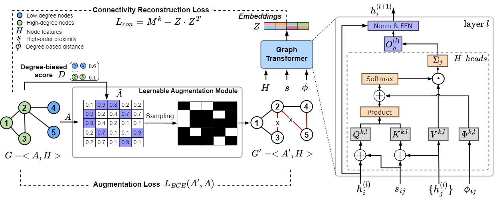

# Community-aware Graph Transformer

Community-aware Graph Transformer (**CGT**) is a novel Graph Transformer model that utilizes community structures to address node degree biases in message-passing mechanism and developed by [NS Lab, CUK](https://nslab-cuk.github.io/) based on pure [PyTorch](https://github.com/pytorch/pytorch) backend. The paper is available on [arXiv](https://arxiv.org/abs/2308.09517).

<p align=center>
  <a href="https://www.python.org/downloads/release/python-360/">
    =3.8.8-3776AB?logo=python&style=flat-square" alt="Python">
  </a>    
  <a href="https://github.com/pytorch/pytorch">
    =1.4-FF6F00?logo=pytorch&style=flat-square" alt="pytorch">
  </a>    
  
  
  
  
  
  
  
</p>

<br>


## 1. Overview

Recent augmentation-based methods showed that message-passing (MP) neural networks often perform poorly on low-degree nodes, leading to degree biases due to a lack of messages reaching low-degree nodes. Despite their success, most methods use heuristic or uniform random augmentations, which are non-differentiable and may not always generate valuable edges for learning representations. In this paper, we propose Community-aware Graph Transformers, namely **CGT**, to learn degree-unbiased representations based on learnable augmentations and graph transformers by extracting within community structures. We first design a learnable graph augmentation to generate more within-community edges connecting low-degree nodes through edge perturbation. Second, we propose an improved self-attention to learn underlying proximity and the roles of nodes within the community. Third, we propose a self-supervised learning task that could learn the representations to preserve the global graph structure and regularize the graph augmentations. Extensive experiments on various benchmark datasets showed CGT outperforms state-of-the-art baselines and significantly improves the node degree biases.

<br>

<p align="center">
  
  <br>
  <b></b> The overall architecture of Community-aware Graph Transformer.
</p>


## 2. Reproducibility

### Datasets and Tasks

We used six publicly available datasets, which are grouped into three different domains, including citation network (Cora, Citeseer, and Pubmed datasets), Co-purchase network networks (Amazon Computers and Photo datasets), and reference network (WikiCS). The datasets are automatically downloaded from Pytorch Geometric.

### Requirements and Environment Setup

The source code was developed in Python 3.8.8. CGT is built using Torch-geometric 2.3.1 and DGL 1.1.0. Please refer to the official websites for installation and setup.
All the requirements are included in the ```environment.yml``` file. 

```
# Conda installation

# Install python environment

conda env create -f environment.yml 
```
### Hyperparameters

The following Options can be passed to exp.py:

```--dataset:``` The name of dataset inputs. For example: ```--dataset cora```

```--lr:``` Learning rate for training the model. For example: ```--lr 0.001```

```--epochs:``` Number of epochs for pre-training the model. For example: ```--epochs 500```

```--run_times_fine:``` Number of epochs for fine-tuning the model. For example: ```--run_times_fine 500``` 

```--layers:``` Number of layers for model training. For example: ```--layers 4```

```--drop:``` Dropout rate. For example: ```--drop 0.5```

```--dims:``` The dimmension of hidden vectors.  For example: ```--dims 64```.

```--k_transition:``` The number of transition step. For example: ```--k_transition 3```.

```--alpha:``` Hyperparameters for degree-related score. For example: ```--alpha 0.1```.

```--beta:``` Hyperparameters for adjacency matrix score. For example: ```--beta 0.95```.

```--alpha_1:``` Hyperparameters for transition construction loss. For example: ```--alpha_1 0.5```.

```--alpha_2:``` Hyperparameters for feature construction loss. For example: ```--alpha_2 0.5```.

```--alpha_3:``` Hyperparameters for augmentation loss. For example: ```--alpha_3 0.5```.


### How to run

The source code contains both pre-training and fine-tuning processes. 
The following commands will run the pre-training process and fine-tune the **CGT** on Cora dataset for both node classification and clustering tasks.

```

python exp.py --dataset cora

```

## 3. Reference

:page_with_curl: Paper [on arXiv](https://arxiv.org/): 
* [](https://arxiv.org/abs/2308.09517) 

:chart_with_upwards_trend: Experimental results [on Papers With Code](https://paperswithcode.com/): 
* [](https://paperswithcode.com/paper/transitivity-preserving-graph-representation)

:pencil: Blog [on Network Science Lab](https://nslab-cuk.github.io/2023/08/17/UGT/): 
* [](https://nslab-cuk.github.io/2023/08/17/UGT/)


## 4. Citing CGT

Please cite our [paper](https://arxiv.org/abs/2308.09517) if you find *CGT* useful in your work:
```
@misc{hoang2023ugt,
      title={Transitivity-Preserving Graph Representation Learning for Bridging Local Connectivity and Role-based Similarity}, 
      author={Van Thuy Hoang and O-Joun Lee},
      year={2023},
      eprint={2308.09517},
      archivePrefix={arXiv},
      primaryClass={cs.LG}
}
```

## 5. Contributors

<a href="https://github.com/NSLab-CUK/Unified-Graph-Transformer/graphs/contributors">
  
</a>


<br>

***

<a href="https://nslab-cuk.github.io/"></a>

***


